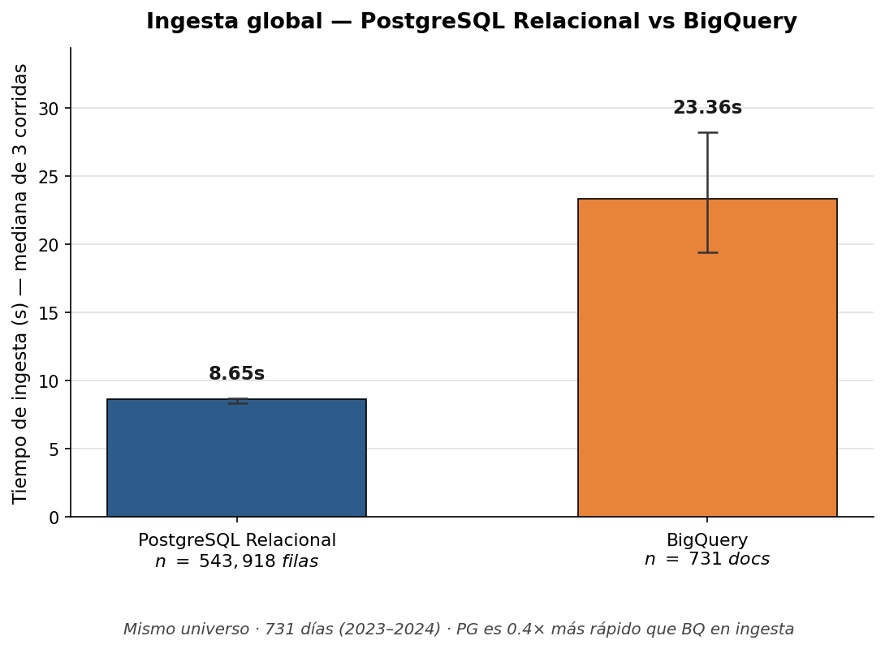
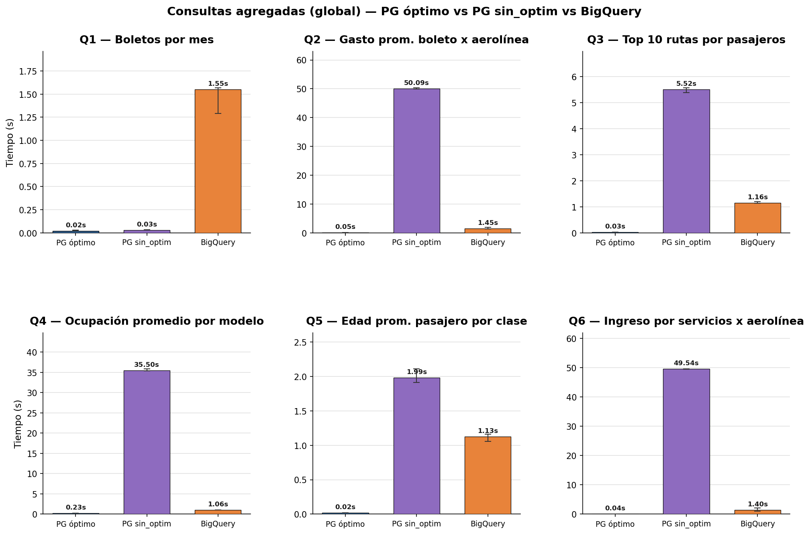
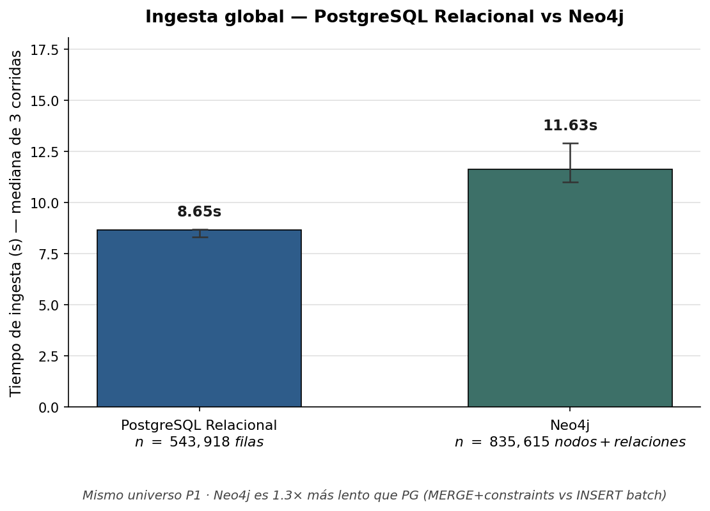
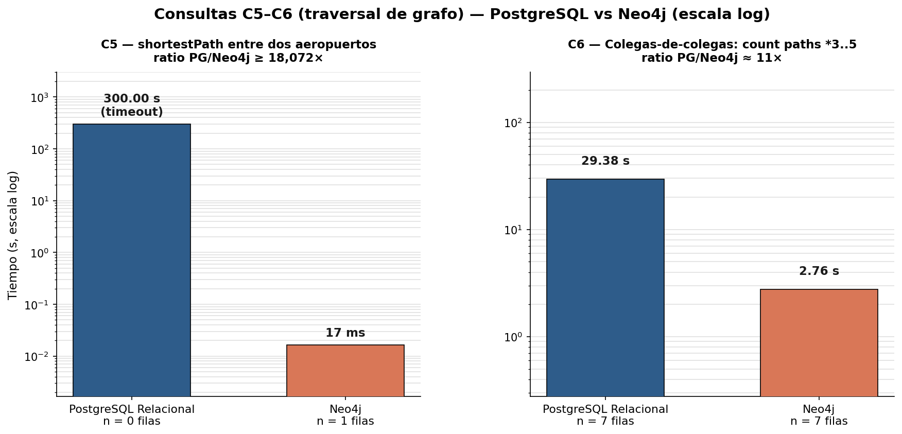
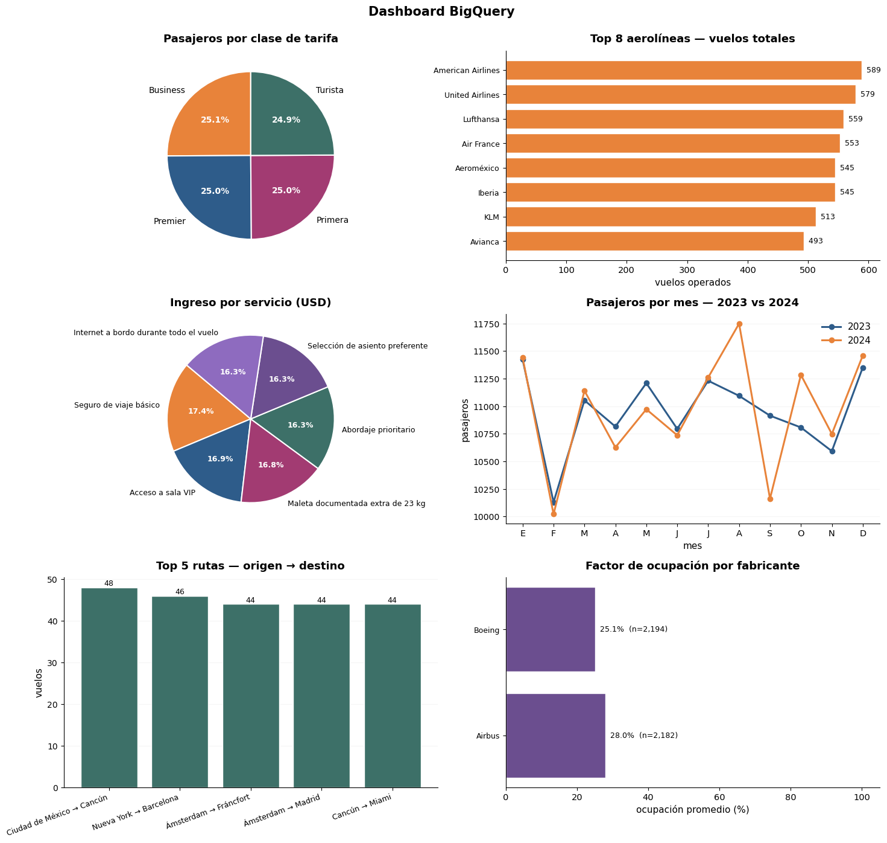

# Aeropuerto NoSQL Benchmark

> Comparativa de bases de datos relacional vs. NoSQL/columnar/grafo sobre un dominio de gestión aeroportuaria: PostgreSQL · MongoDB · BigQuery · Neo4j.

[](https://www.python.org/)
[](https://www.postgresql.org/)
[](https://www.mongodb.com/)
[](https://cloud.google.com/bigquery)
[](https://neo4j.com/)
[](LICENSE)

---

## Problema

Elegir el motor de base de datos correcto depende del **patrón de acceso**, no solo del modelo de datos. Este proyecto modela un escenario realista de gestión aeroportuaria (vuelos, pasajeros, aeronaves, reservas, dashboards) y mide costo/latencia de ingestión y consulta en cuatro motores con paradigmas distintos.

## Motores comparados

| Motor | Tipo | Caso de uso evaluado |
|-------|------|----------------------|
| **PostgreSQL** | Relacional | Baseline OLTP + reporting |
| **MongoDB** | Documental | Modelo jerárquico (un documento por reserva) |
| **BigQuery** | Columnar cloud | OLAP / dashboards a escala |
| **Neo4j** | Grafo | Rutas, escalas, consultas de conectividad |

## Resultados clave

Ingestión PG vs BigQuery:



Consultas PG vs BigQuery:



Ingestión PG vs Neo4j:



Consultas en grafo (Neo4j):



Dashboards generados sobre BigQuery:



Métricas crudas en [`assets/metrics/`](assets/metrics/). Reporte completo en [`docs/benchmark.pdf`](docs/benchmark.pdf).

## Stack

- **Lenguaje**: Python 3.10+
- **BDs**: PostgreSQL 15, MongoDB 7, Neo4j 5, BigQuery
- **Cliente**: SQLAlchemy, psycopg2, pymongo, neo4j-driver, google-cloud-bigquery
- **Análisis**: Pandas, Matplotlib, Seaborn
- **Modelado**: MySQL Workbench (`docs/ER.mwb`)

## Estructura

```
aeropuerto-nosql-benchmark/
├── README.md
├── requirements.txt
├── LICENSE
├── .gitignore
├── notebooks/
│   ├── 01_modelado_y_json.ipynb      # genera dataset sintético
│   ├── 02_ingesta_sql_vs_nosql.ipynb # PostgreSQL vs MongoDB
│   ├── 03_bigquery_vs_postgres.ipynb # PG vs BigQuery (OLAP)
│   └── 04_neo4j_grafo.ipynb          # PG vs Neo4j (grafo)
├── sql/
│   └── schema.sql                    # DDL PostgreSQL
├── scripts/
│   ├── start_services.sh             # brew services (Postgres/Mongo/Neo4j)
│   └── stop_services.sh
├── docs/
│   ├── benchmark.pdf                 # reporte final
│   ├── ER.pdf                        # diagrama Entidad-Relación
│   ├── ER.mwb                        # fuente MySQL Workbench
│   ├── parte1.md … parte4.md         # resúmenes por etapa
├── data/
│   ├── README.md
│   └── sample/                       # muestra demo (versionada)
└── assets/
    ├── images/                       # gráficas comparativas
    └── metrics/                      # CSVs de métricas
```

## Setup

```bash
git clone https://github.com/rodartej/aeropuerto-nosql-benchmark.git
cd aeropuerto-nosql-benchmark

python -m venv .venv
source .venv/bin/activate
pip install -r requirements.txt
```

### Servicios locales (macOS · Homebrew)

```bash
brew install postgresql@15 mongodb-community neo4j
./scripts/start_services.sh
```

Para Linux usar paquetes nativos o Docker (ver `docs/parte2.md`).

### BigQuery

```bash
gcloud auth application-default login
export GOOGLE_CLOUD_PROJECT="tu-proyecto"
```

### Credenciales locales

Crear `.env` (no versionado):

```bash
PG_USER=postgres
PG_PASSWORD=tu_password
PG_DB=aeropuerto
MONGO_URI=mongodb://localhost:27017/
NEO4J_URI=bolt://localhost:7687
NEO4J_USER=neo4j
NEO4J_PASSWORD=tu_password
GOOGLE_CLOUD_PROJECT=tu-proyecto-gcp
```

## Reproducir

```bash
jupyter nbconvert --execute notebooks/01_modelado_y_json.ipynb
jupyter nbconvert --execute notebooks/02_ingesta_sql_vs_nosql.ipynb
jupyter nbconvert --execute notebooks/03_bigquery_vs_postgres.ipynb
jupyter nbconvert --execute notebooks/04_neo4j_grafo.ipynb
```

Ver [`data/README.md`](data/README.md) para generación de datasets.

## Metodología

1. **Modelado**: schema relacional 3FN + denormalización jerárquica (Mongo) + modelo de grafo (Neo4j).
2. **Generación**: dataset sintético con `Faker` + lógica de negocio (rutas, vuelos, reservas). 10+ años de tráfico simulado.
3. **Ingestión**: medición de tiempo + throughput por año, por motor.
4. **Consultas**: 5 queries representativas (top rutas, ocupación, ingresos, dashboards mensuales) ejecutadas 10x.
5. **Reporte**: tablas + gráficas + conclusiones por caso de uso.

## Decisiones técnicas

- **JSONs jerárquicos en MongoDB**: documento-por-reserva permite consultas O(1) por reserva pero penaliza agregados — cuantificado en parte 2.
- **BigQuery sin particionado vs particionado**: explorado el impacto en costo/tiempo (parte 3).
- **Neo4j Cypher vs joins SQL**: queries de conectividad (escalas, rutas alternativas) 10-100x más rápidas en Neo4j (parte 4).

## Resúmenes por etapa

- [Parte 1 — Modelado y generación de datos](docs/parte1.md)
- [Parte 2 — Ingestión SQL vs NoSQL](docs/parte2.md)
- [Parte 3 — BigQuery vs PostgreSQL (OLAP)](docs/parte3.md)
- [Parte 4 — Neo4j vs PostgreSQL (grafo)](docs/parte4.md)

## Contexto académico

Proyecto final del curso **Bases de Datos No Estructuradas** — Ciencia de Datos (2026).

## Licencia

MIT — ver [LICENSE](LICENSE).

## Autor

**Jesús Eduardo Rodarte Rosales**
[GitHub](https://github.com/rodartej) · jesusrod254@gmail.com
